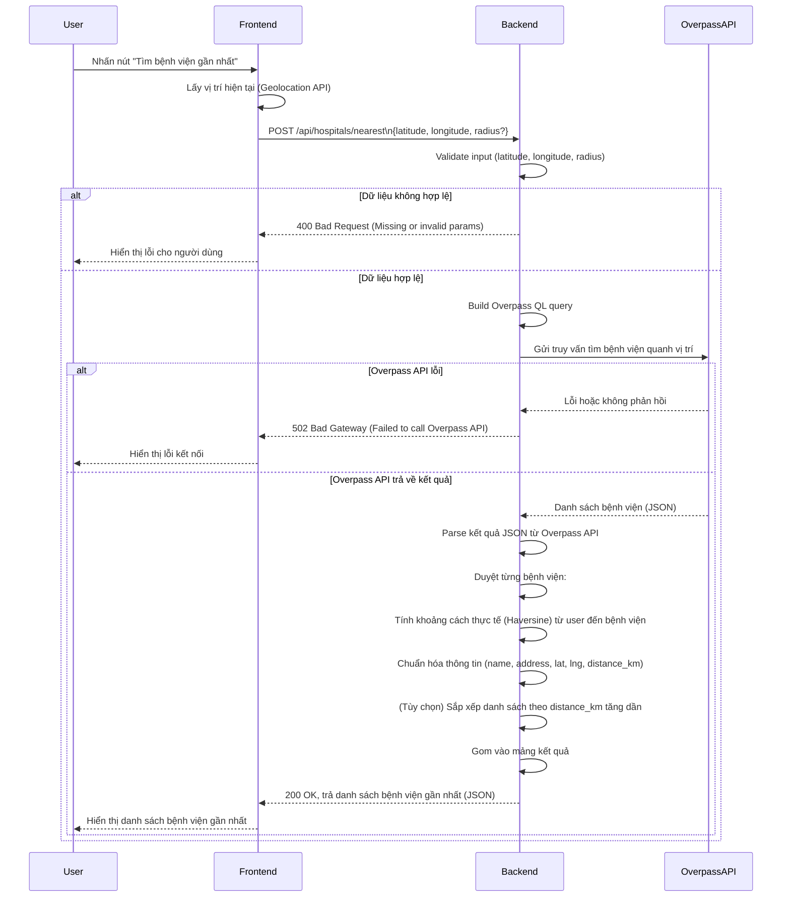

```mermaid
sequenceDiagram
    participant User
    participant Frontend
    participant Backend
    participant OverpassAPI

    User->>Frontend: Nhấn nút "Tìm bệnh viện gần nhất"
    Frontend->>Frontend: Lấy vị trí hiện tại (Geolocation API)
    Frontend->>Backend: POST /api/hospitals/nearest\n{latitude, longitude, radius?}
    Backend->>Backend: Validate input (latitude, longitude, radius)
    alt Dữ liệu không hợp lệ
        Backend-->>Frontend: 400 Bad Request (Missing or invalid params)
        Frontend-->>User: Hiển thị lỗi cho người dùng
    else Dữ liệu hợp lệ
        Backend->>Backend: Build Overpass QL query
        Backend->>OverpassAPI: Gửi truy vấn tìm bệnh viện quanh vị trí
        alt Overpass API lỗi
            OverpassAPI-->>Backend: Lỗi hoặc không phản hồi
            Backend-->>Frontend: 502 Bad Gateway (Failed to call Overpass API)
            Frontend-->>User: Hiển thị lỗi kết nối
        else Overpass API trả về kết quả
            OverpassAPI-->>Backend: Danh sách bệnh viện (JSON)
            Backend->>Backend: Parse kết quả JSON từ Overpass API
            Backend->>Backend: Duyệt từng bệnh viện:
                Backend->>Backend: Tính khoảng cách thực tế (Haversine) từ user đến bệnh viện
                Backend->>Backend: Chuẩn hóa thông tin (name, address, lat, lng, distance_km)
            Backend->>Backend: (Tùy chọn) Sắp xếp danh sách theo distance_km tăng dần
            Backend->>Backend: Gom vào mảng kết quả
            Backend-->>Frontend: 200 OK, trả danh sách bệnh viện gần nhất (JSON)
            Frontend-->>User: Hiển thị danh sách bệnh viện gần nhất
        end
    end
```

---

**Chú thích:**
- Sơ đồ thể hiện đầy đủ các bước kiểm tra, xử lý lỗi và trả kết quả.
- Có thể dùng cho tài liệu kỹ thuật hoặc báo cáo hệ thống.