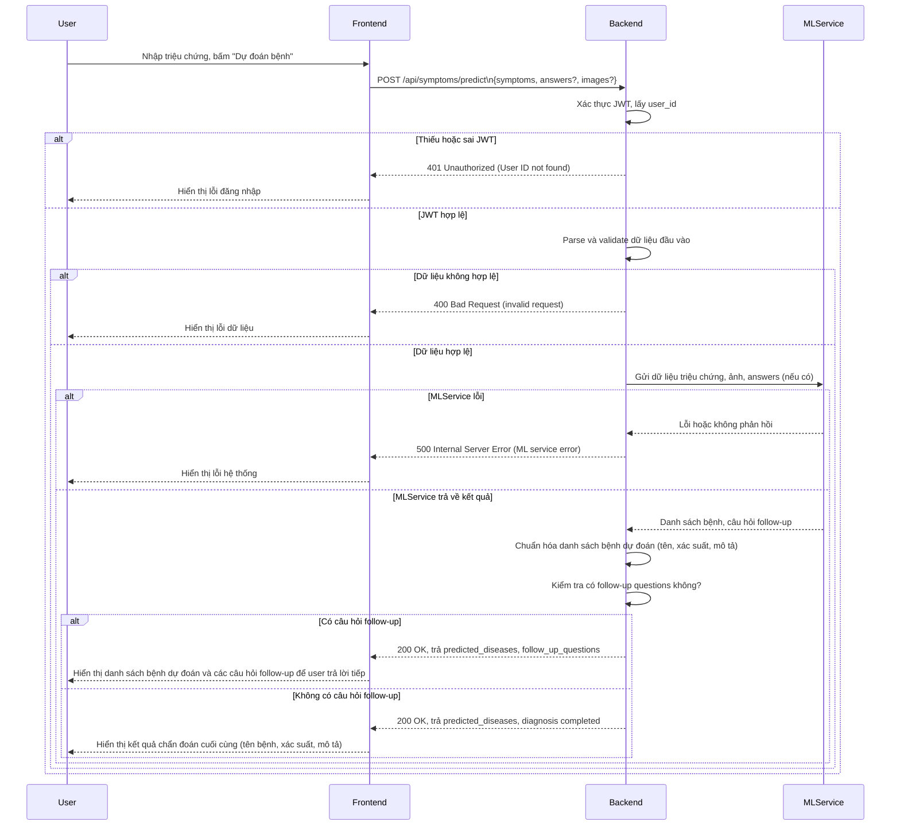

---

**Chú thích:**
- Sơ đồ mô tả luồng dự đoán bệnh dựa trên triệu chứng, có thể gồm ảnh và câu trả lời follow-up.
- Thể hiện rõ các bước xác thực, xử lý lỗi, gọi ML service và trả kết quả.
- Áp dụng cho endpoint /api/symptoms/predict hoặc các endpoint tương tự trong hệ thống.
